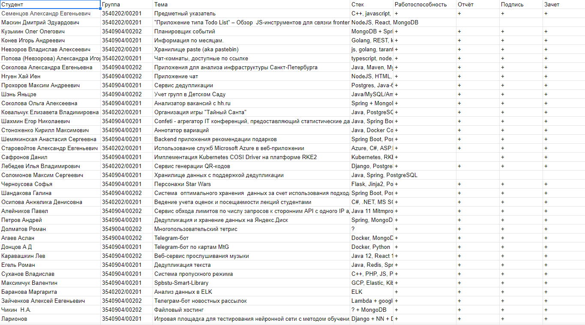

# Семестр 3

> Сбор информации о семестре окончен, но вы можете внести свои замечания / дополнения 
> в [данном обсуждении](https://github.com/Tka4uk-Andrei/semesters_description/issues/5)

## Быстрая навигация

- [Машинное обучение][1]
- [Верификация распределенных алгоритмов и систем][2]
- [Системы анализа больших данных][3]
- [Облачные инфраструктуры и сервисы][4]
- [Научный дискурс][5]
- [Образовательный форсайт][6]

[1]: #машинное-обучение
[2]: #верификация-распределенных-алгоритмов-и-систем
[3]: #системы-анализа-больших-данных
[4]: #Облачные-инфраструктуры-и-сервисы
[5]: #Научный-дискурс
[6]: #Образовательный-форсайт

[Ссылка](https://1drv.ms/u/s!AlIKVg2kjknYmfU28zVGXDZwothJhg?e=DRDzyL) на диск OneDrive с материалами по предметам 3го семестра

## Машинное обучение

__Вид контроля:__ Экзамен, курсовая работа

__Лекции ведёт:__ Уткин Лев Владимирович \
__Практические занятия:__ Селин Иван Андреевич

[Материалы лекций](https://levutkin.github.io/teaching/machine-learning) Льва Владимировича

В течении семестра требуется сделать курсовую работу. Пожелание по направлению 
темы можно оставить в [опросе][ms_teams_ml_servey]. _Срок до 30-го сентября включительно_

[Таблица с распределением по темам](https://docs.google.com/spreadsheets/d/1tyqxauxMEewvYA6uk_Sbl8uVIOtg8rXpNNDf0kxgNkw/edit#gid=1650386243)

[ms_teams_ml_servey]: [https://teams.microsoft.com/l/message/19:ap3K8ks7F9bsgnXxdCx3hRp8k-nwvJ-dmSdrDJGmNmY1@thread.tacv2/1663939303788?tenantId=137a6a63-e79e-4931-af0c-eea232c41af7&groupId=34edd294-2d63-49e5-983c-5f08e0f51685&parentMessageId=1663939303788&teamName=%D0%9C%D0%B0%D1%88%D0%B8%D0%BD%D0%BD%D0%BE%D0%B5%20%D0%BE%D0%B1%D1%83%D1%87%D0%B5%D0%BD%D0%B8%D0%B5%20%20%D0%A1%D0%B5%D0%BB%D0%B8%D0%BD%20%D0%98%D0%B2%D0%B0%D0%BD%20%D0%90%D0%BD%D0%B4%D1%80%D0%B5%D0%B5%D0%B2%D0%B8%D1%87&channelName=%D0%9E%D0%B1%D1%89%D0%B8%D0%B9&createdTime=1663939303788&allowXTenantAccess=false]

---

## Верификация распределенных алгоритмов и систем

__Вид контроля:__ Экзамен, курсовая
__Лекции ведёт:__ Карпов Юрий Глебович
__Практические занятия:__ Шошмина Ирина Владимировна

В середине семестра, на лекции, будет [распределение по вариантам курсовых работ](https://docs.google.com/spreadsheets/d/1PAN2w99Hiomng_ulVymtN0baQaXL3IfaRF7W-Md0opE/edit#gid=534096994). Для получения вариантов старостам требуется прислать 
список групп на корпоративную почту Ирины Владимировны (можно подглядеть у других старост или на dl).
Сама курсовая работа связана с верификацией программы с использованием Spin.

> Курсовую крайне желательно сдавать до начала сессии. Время сдачи курсовой желательно заранее согласовать

Также надо будет делать задачи, которые будут выдавать после лекций. Также задачи
для личного разбора/решения будут выкладываться на [dl](https://dl.spbstu.ru/course/view.php?id=4042).

[Ссылка на методичку по Spin](https://1drv.ms/b/s!AlIKVg2kjknYmfYfHawLtoc9F6N9Hg?e=wrs65d)
[Ссылка на задачник](https://1drv.ms/b/s!AlIKVg2kjknYmfYepS2beXnokigEow?e=rNSheX)

---

## Системы анализа больших данных

__Вид контроля:__ Экзамен.

> __Важно!__ Выполненная курсовая работа даёт оценку 5 на экзамене.

### Про курсовую

В рамках курсовой работы требуется реализовать систему дедупликации данных, провести нагрузочное тестирование и проверить её характеристики.

В ходе работы требуется:
- установить зависимость скорости чтения/записи данных в локальное хранилище в зависимости от размера сегмента
- установить оптимальный размер сегмента блока данных при котором наблюдается
  - максимальная скорость записи
  - максимальная скорость чтения
  - процент ошибки восстановления данных в зависимости от использованного алгоритма hash

Система состоит из следующих компонент:
- Источник данных
- Генератор данных
- Хранилище данных
- Хранилище таблиц hash-значений и ссылок
- Алгоритм вычисления hash

Во время защиты надо будет показать работающую систему и отчёт.

Ещё более подробно про работу можно почитать в 
[методичке](https://1drv.ms/b/s!AlIKVg2kjknYmfU8jcaaqysbTZ2UPA?e=RuHOAu) 
и [презентации](https://1drv.ms/p/s!AlIKVg2kjknYmfU79HsS2DMl-C-umw?e=mkXOo5).

---

## Облачные инфраструктуры и сервисы

__Вид контроля:__ Зачёт, курсовая работа
__Занятия ведёт:__ Селин Иван Андреевич

Надо получить просто зачёт

* Лекции будут выложены онлайн архивом
* Практики проводятся по средам в 12:00. Можно приходить только если есть вопросы

**Задание**
Придумать и разработать систему из нескольких компонент и выложить её в открытый 
доступ (в любое облако). Компонент должно быть как минимум две 
(например, фронт и бэк или бэк и бд).

Этапы:
1. Заполнить [опрос][ms_teams_cloud_servey] от Селина по выбору темы и дождаться 
   одобрения
2. Разработать систему и разместить ей в облаке. Главное, чтобы до неё можно 
   было добраться снаружи
3. Написать отчёт по разработке, в нём обосновать почему вы решили разместить 
   компоненты у этого облачного провайдера и как вы это сделали. Также нужно 
   сказать как можно проверить роботоспособность системы.
4. Скинуть Селину на проверку. Он будет проверять работоспособность системы 
   (что до неё можно достучаться снаружи и как она работает) и отчёт. В итоговой
   таблице будут плюсики в табличку.

Прогресс по курсовой можно отследить [тут](https://docs.google.com/spreadsheets/d/12rh7dTInUrvRqbkkrdm_i1d3CfYoKlUllx4l-nw3SpU/edit#gid=0)

Примеры тем:

[ms_teams_cloud_servey]:[https://teams.microsoft.com/l/message/19:JEUTbu1txqhHuYe8v97pHKu8QJCvXKl04rQWwVKq2Ss1@thread.tacv2/1663943722586?tenantId=137a6a63-e79e-4931-af0c-eea232c41af7&groupId=c7d9ce00-a189-49bf-bba1-ba2f3f607b79&parentMessageId=1663943722586&teamName=%D0%9E%D0%B1%D0%BB%D0%B0%D1%87%D0%BD%D1%8B%D0%B5%20%D0%B8%D0%BD%D1%84%D1%80%D0%B0%D1%81%D1%82%D1%80%D1%83%D0%BA%D1%82%D1%83%D1%80%D1%8B%20%D0%B8%20%D1%81%D0%B5%D1%80%D0%B2%D0%B8%D1%81%D1%8B%20%20%D0%A1%D0%B5%D0%BB%D0%B8%D0%BD%20%D0%98%D0%B2%D0%B0%D0%BD%20%D0%90%D0%BD%D0%B4%D1%80%D0%B5%D0%B5%D0%B2%D0%B8%D1%87&channelName=%D0%9E%D0%B1%D1%89%D0%B8%D0%B9&createdTime=1663943722586&allowXTenantAccess=false]

---

## Научный дискурс

__Вид контроля:__
__Занятия ведёт:__ Молодяков Сергей Александрович

__В процессе написания__

Кратко: два выступления (презентации) и статья. Статья должна быть оформлена по требованиям IEEE.

В выступлениях нужно отразить:
- Подробный архитектурный уровень (функциональное назначение каждого блока (оговорить словами))
- Программная реализация каждого блока архитектурного уровня (название классов, подклассов, кто кого наследует и их функциональное назначение (оговорить словами))
- Отладка, тестирование. TEST BENCH, архитектура и программная реализация тестов.
- Результаты (метрики: число строк кода, сравнение с результатами конкурентов, скриншоты, руководство пользователя, продвинутого пользователя, какие задачи предстоит решить в будущем для совершенствования разработки)

Первая презетация должна быть посвящена первым двум пунктам. Остальные пункты 
должны быть изложены во второй презентации. Также нужно сделать обобщающую 
(финальную) презентацию и написать статью по выбранной теме магистерской 
диссертации.

В конце семестра нужно подготовить официальное задание на выпускную квалификационную работу (ВКР)
и сдать его руководителю магистерских программ.

---

## Образовательный форсайт

__Вопросы можно задать:__ Старостам групп или Александру Петрову
__Вид контроля:__ Зачёт

По данному предмету нужно пройти дистанционный курс на openEdu или dl c трудоёмкостью 
5 зачётных едениц и более. Список таких курсов приведён ниже в таблице. Полный список 
(з.е. от 1 до 6) доступен [тут](https://1drv.ms/b/s!AlIKVg2kjknYmfV6Grue8HNHIbrz0Q?e=NLO9W9). 
О выбранном курсе требуется сообщить старосте и установить его в личном кабинете.

| №    | Название дисциплины                                           | Платформа (ссылка на курс)                        | Количество з.е. |
|------|---------------------------------------------------------------|---------------------------------------------------|-----------------|
| 1.   | Инженерная и компьютерная графика                             | https://openedu.ru/course/spbstu/COMPGR/          | 5               |
| 3.   | Бережливое производство                                       | https://openedu.ru/course/spbstu/LEANPROD/        | 5               |
| 22.  | История	и	философия технической реальности               | https://openedu.ru/course/spbstu/HPTR/            | 5               |
| 35.  | Логистика                                                     | https://openedu.ru/course/spbstu/LOGIST/          | 6               |
| 36.  | Маркетинг                                                     | https://openedu.ru/course/spbstu/MARKET/          | 5               |
| 39.  | Математические	методы в экономике                             | https://openedu.ru/course/spbstu/BUSMAT/          | 5               |
| 41.  | Методы	вычислительной математики                              | https://openedu.ru/course/spbstu/NUMMETH/         | 5               |
| 52.  | Организация, технология и проектирование предприятий торговли | https://openedu.ru/course/spbstu/TRADORG/         | 5               |
| 57.  | Основы расчета строительных конструкций                       | https://openedu.ru/course/spbstu/BASBUILD/        | 5               |
| 65.  | Построение  бизнес-процессов интеллектуального предприятия    | https://dl-iamt.spbstu.ru/course/view.php?id=80   | 5               |
| 67.  | Производственный менеджмент                                   | https://openedu.ru/course/spbstu/INDMNG/          | 6               |
| 77.  | Теоретическая механика 1 семестр                              | https://openedu.ru/course/spbstu/TMECH/           | 5               |
| 78.  | Теоретическая механика 2 семестр                              | https://openedu.ru/course/spbstu/TMECH2/          | 5               |
| 80.  | Теория	решения изобретательских задач (ТРИЗ)                  | https://openedu.ru/course/spbstu/TIPSOL/          | 5               |
| 85.  | Управление данными                                            | https://openedu.ru/course/spbstu/DATAM/           | 5               |
| 87.  | Управление человеческими ресурсами                            | https://openedu.ru/course/spbstu/HRM/             | 5               |
| 92.  | Финансовый менеджмент                                         | https://dl-imet.spbstu.ru/course/view.php?id=9770 | 5               |
| 96.  | Цифровой	маркетинг и социальные сети                          | https://openedu.ru/course/spbstu/DIGMARK/         | 5               |
| 106. | Экономика труда и социально-трудовые отношения                | https://openedu.ru/course/spbstu/ECOLAB/          | 5               |
| 111. | Язык делового общения                                         | https://dl-hum.spbstu.ru/course/view.php?id=7849  | 5               |
